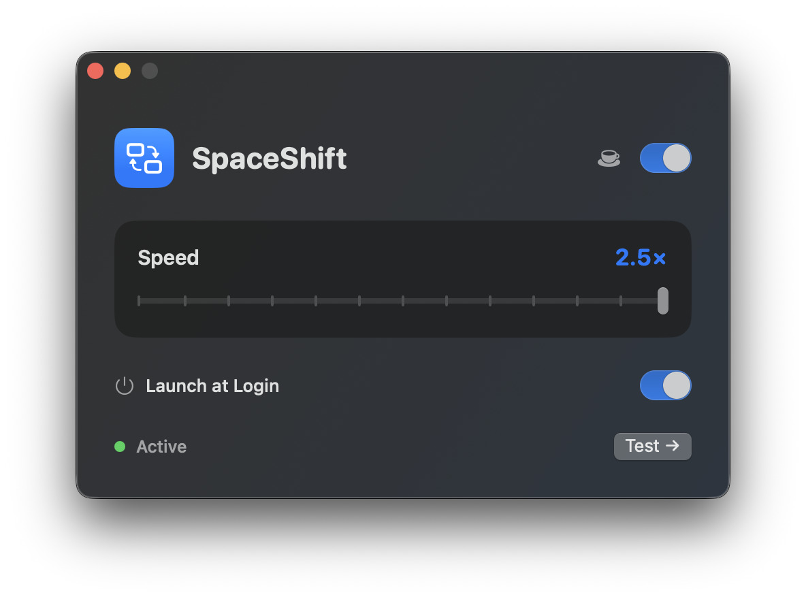

# SpaceShift

<p align="center">
  
</p>

<p align="center">
  <strong>Faster macOS Space switching without removing the native animation.</strong>
</p>

<p align="center">
  <a href="https://github.com/ReutS1/SpaceShift/releases/latest"></a>
  
  <a href="https://github.com/ReutS1/SpaceShift/actions"></a>
</p>

<p align="center">
  <a href="https://github.com/ReutS1/SpaceShift/releases/download/v2.4/SpaceShift-2.4.dmg"><strong>Download SpaceShift 2.4</strong></a>
  ·
  <a href="https://github.com/ReutS1/SpaceShift/releases">All releases</a>
</p>



SpaceShift is a lightweight native menu bar utility for macOS. It accelerates horizontal Space transitions while preserving Apple's familiar animation—especially useful on high-refresh-rate displays.

## Highlights

- Adjustable switching speed from **1× to 2.5×**
- Works with `Control + Left/Right Arrow`
- Supports physical three-finger horizontal trackpad swipes
- Runs quietly in the menu bar without occupying the Dock
- Optional **Launch at Login** using Apple's `SMAppService`
- No analytics, network requests, background updater, or preference hacks
- Does not disable SIP, enable Reduce Motion, or restart Dock

## Requirements

- macOS 14 Sonoma or newer
- Accessibility permission for intercepting Space-switching input
- A trackpad is required for synthetic native swipe playback

## Installation

1. Download [`SpaceShift-2.4.dmg`](https://github.com/ReutS1/SpaceShift/releases/download/v2.4/SpaceShift-2.4.dmg).
2. Open the disk image and drag **SpaceShift** to **Applications**.
3. Launch SpaceShift.
4. Click **Allow…**, then enable SpaceShift under **System Settings → Privacy & Security → Accessibility**.
5. Return to SpaceShift and choose your preferred speed.

> The current 2.4 community build is ad-hoc signed rather than Apple-notarized. If macOS blocks the first launch, open **System Settings → Privacy & Security** and choose **Open Anyway**. Future public releases should be Developer ID signed and notarized.

SpaceShift continues running after its settings window is closed. Use the menu bar icon to pause acceleration, change presets, test a transition, reopen settings, or quit.

## How it works

SpaceShift listens for supported keyboard and trackpad input, then supplies Dock with a synthetic native swipe at the selected velocity. Dock still renders its own horizontal Spaces animation—it simply completes faster.

The speed slider ranges from the normal native gesture velocity (`40`) to a fast but still visible transition (`100`). The default value is `60`, approximately **1.5×**.

## Privacy and security

SpaceShift has no networking or analytics code. Intercepted input events are neither logged nor persisted. Accessibility access is used only to recognize supported Space-switching gestures and shortcuts.

See [SECURITY.md](SECURITY.md) for the release security model and distribution notes.

## Build from source

Requirements: macOS 14+, Swift 6-compatible toolchain, and Apple Command Line Tools.

```sh
git clone https://github.com/ReutS1/SpaceShift.git
cd SpaceShift
./scripts/build-app.sh release
open dist/SpaceShift.app
```

Create the drag-to-Applications installer:

```sh
./scripts/build-dmg.sh
```

For Developer ID signing and notarization instructions, see [DEVELOPER.md](DEVELOPER.md).

## Contributing

Bug reports and focused improvements are welcome. Please read [CONTRIBUTING.md](CONTRIBUTING.md) before submitting a pull request.

## Credits

The synthetic Dock-swipe technique and empirical velocity values are adapted from jurplel's MIT-licensed [InstantSpaceSwitcher](https://github.com/jurplel/InstantSpaceSwitcher). See [THIRD_PARTY_NOTICES.md](THIRD_PARTY_NOTICES.md) for attribution and bundled third-party licenses.

## Copyright

Copyright © 2026 ReutS1. No license is granted for the SpaceShift source code unless one is added explicitly. Third-party components remain available under their respective licenses.
